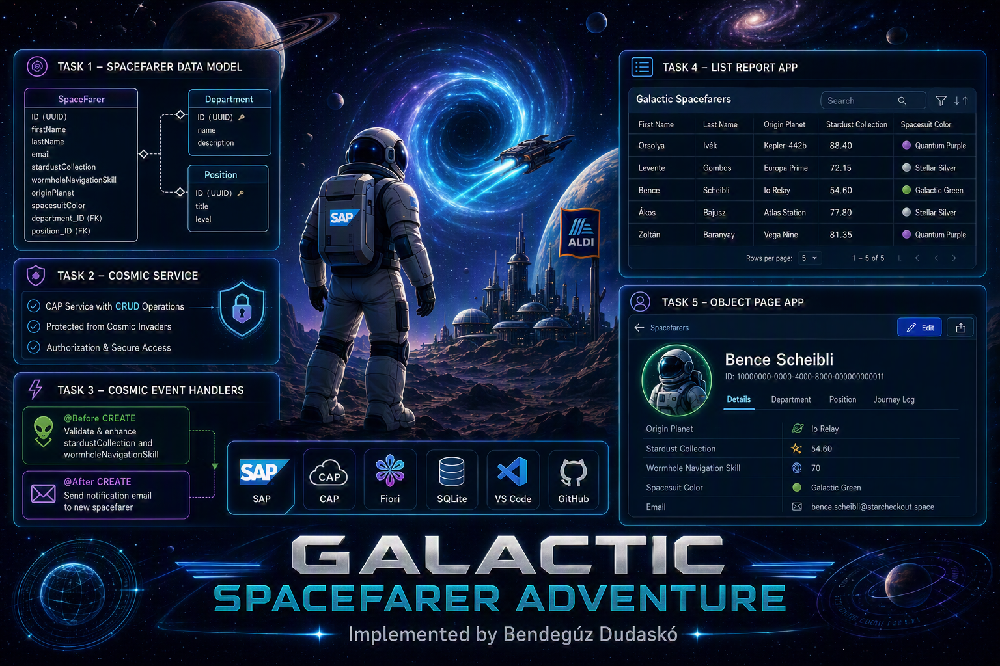

# Galactic-Spacefarer-Adventure-Aldi



SAP CAP project for the Galactic Spacefarer Adventure exercise.

## Project Structure

File or Folder | Purpose
---------|----------
`app/` | UI frontend artifacts
`db/` | CDS data model and CSV seed data
`srv/` | service definition (`SpaceFarerService`), event handlers, and notification services
`test/` | automated integration tests and isolated test CSV fixtures
`test/http/` | HTTP request scenarios for auth and CRUD validation
`.github/workflows/` | CI workflow for compile + test checks on pull requests

## Quick Start

1. Install dependencies:

```bash
npm install
```

> **Important:** `npm install` automatically runs a `postinstall` script that deletes a bundled duplicate of `@sap/cds` shipped inside `@sap/cds-dk`. Without this, CAP prints an error about `@sap/cds` being loaded from two locations and the dev server may fail. See [Known Issue](#known-issue-sap-cds-loaded-from-different-locations) for full details.

2. Deploy the local database (one-time setup):

```bash
cds deploy --to sqlite
```

This creates the `db.sqlite` file and populates it with CSV seed data. You only need to run this once, or when you:
- Change the CDS schema
- Want to reset data back to the CSV files
- Delete the `db.sqlite` file

3. Start secure local development (mocked auth enabled):

```bash
npm run dev
```

4. Alternative profile for managed-company browsers (dummy auth):

```bash
npm run dev:company
```

5. Run automated tests:

```bash
npm run test:cap
```

## Scripts

- `npm run dev` -> `cds watch`
- `npm run dev:company` -> `cds watch --profile development-company`
- `npm run start` -> `cds-serve`
- `npm run build` -> build CAP artifacts (`cds build`)
- `npm run build:cap` -> build CAP artifacts only
- `npm run build:ui` -> build Fiori UI module (`app/spacefarers`)
- `npm run build:all` -> build CAP + Fiori UI modules
- `npm run compile:db` -> compile CDS model in `db/` to SQL
- `npm run test:cap` -> run CAP test suite in `test` profile
- `npm run test:cap:log` -> run CAP test suite with verbose debug logs
- `npm run repl` -> CAP REPL

## Services and Authorization (Current State)

### SpaceFarerService

Service path: `/spacefarer-service`

In `srv/spacefarer-service.cds`:

- Service level: `@requires: 'authenticated-user'`
- `SpaceFarer` projection: restricted with `@restrict`
	- Grants: `CREATE`, `READ`, `UPDATE`, `DELETE`
	- Role: `SpacefarerViewer`
	- Row-level filter: `originPlanet = $user.attr.planet`
- `SpaceFarer` projection: additional read access for role `SpacefarerAdmin`
	- Grants: `CREATE`, `READ`, `UPDATE`, `DELETE`
	- No row-level filter
- `Department` projection: `@readonly`
- `Position` projection: `@readonly`

## Local Auth Profiles

`development` profile (`mocked` auth users):

- `space-admin` / `admin123` with `planet = Orion Belt`
	- Roles: `authenticated-user`, `SpacefarerAdmin`
- `space-viewer` / `viewer123` with `planet = Io Relay`
	- Roles: `authenticated-user`, `SpacefarerViewer`

`development-company` profile:

- `auth.kind = dummy`
- Used only to continue local UI work when company-managed browser policies block Basic Auth login popups.

`test` profile:

- `auth.kind = mocked` with the same `space-admin` and `space-viewer` users
- In-memory SQLite
- Activated by `npm run test:cap` via `CDS_ENV=test`

## HTTP Validation Scenarios

Use files in `test/http/`:

- `test/http/auth.http`
- `test/http/spacefarer-service.http`

They cover:

- unauthenticated vs authenticated access
- viewer/admin behavior
- CRUD checks against `SpaceFarer`
- readonly checks for `Department` and `Position`

Note: Basic auth values in the HTTP files are Base64-encoded `username:password`.

## Automated Test Coverage

Primary test suite: `test/space-farer-service.test.ts`

Dedicated test fixtures:

- `test/data/galactic.spacefarer.adventure-SpaceFarer.csv`
- `test/data/galactic.spacefarer.adventure-Department.csv`
- `test/data/galactic.spacefarer.adventure-Position.csv`

Current test organization:

- Service Root Authorization
- SpaceFarer Entity
- Department Entity (`@readonly` behavior)
- Position Entity (`@readonly` behavior)

The suite verifies authenticated access, role-based behavior, and entity-level write restrictions.

## Task 3 - Cosmic Event Handlers

Task 3 is implemented in `srv/spacefarer-service.ts` using CAP lifecycle hooks on `CREATE` for `SpaceFarer`.

### CREATE Parameters -> Generated Values

When `POST /spacefarer-service/SpaceFarer` is called, Task 3 logic produces these outcomes:

| Create payload parameter | Rule in Task 3 logic | What is generated or changed by server | Result if rule fails |
|---|---|---|---|
| `wormholeNavigationSkill` | Must exist and be in range `0..100` | Used to find matching `Position` (`skillBoundary_min <= value <= skillBoundary_max`) and set `position_ID` | Request rejected (`400` or `422`), no create |
| `stardustCollection` | Must exist and be in range `0..100` | Used to find matching `SpacesuitColorBoundary` (`stardustCollection_min <= value <= stardustCollection_max`) and set `spacesuitColor` | Request rejected (`400` or `422`), no create |
| `position_ID` (if sent by client) | Treated as non-authoritative for Task 3 create | Overwritten by computed value from `Position` boundary lookup | N/A (server value wins) |
| `spacesuitColor` (if sent by client) | Treated as non-authoritative for Task 3 create | Overwritten by computed value from `SpacesuitColorBoundary` lookup | N/A (server value wins) |
| `department.name` | Required by data model (`department` composition is mandatory and `name` is mandatory) | Department child record is persisted together with parent SpaceFarer create | Request rejected by CAP model validation if missing/invalid |
| `email` | Required to send post-create notification | Used as notification recipient (`to`) in `@After CREATE` | Create still succeeds; notification is skipped if missing |
| `firstName`, `lastName`, `originPlanet`, computed `position_ID`, computed `spacesuitColor`, skill/stardust | Used to compose welcome message body | Welcome email payload (`subject`, `body`) sent via `notificationService` event `notifyOnboarder` | If send fails, error is logged; create is not rolled back |

Notification implementation by environment:

- `development` and `test`: `srv/notification-mock-service.ts`
- `production`: `srv/notification-production-service.ts`

Task 3 tests in `test/space-farer-service.test.ts` verify:

- Auto-enhancement of candidate data at create time
- Rejection for out-of-range skill and stardust values
- Notification trigger after successful candidate creation

## CI (GitHub Actions)

Workflow: `.github/workflows/build-and-test.yml`

- Name: `Build and Test Check`
- Trigger: pull requests to `main`
- Steps:
	- install dependencies (`npm ci`)
	- compile CDS model (`npm run compile:db`)
	- build CAP artifacts (`npm run build:cap`)
	- build Fiori UI module (`npm run build:ui`)
	- run tests (`npm run test:cap`)

## Data Notes

Application seed data (`db/data/`):

- `Position.ID` seed IDs use `20000000-0000-4000-8000-...`
- `SpaceFarer.ID` seed IDs use `10000000-0000-4000-8000-...`
- `Department.spaceFarer_ID` seed IDs use `30000000-0000-4000-8000-...`

Test seed data (`test/data/`):

- `Position.ID` seed IDs use `21000000-0000-4000-8000-...`
- `SpaceFarer.ID` and `Department.spaceFarer_ID` use `31000000-0000-4000-8000-...`

## Code Quality

Husky is enabled via `prepare` script and currently runs schema validation with `npm run compile:db` before commit.

## Submission Notes

On the development machine used for this project, the browser is company-managed and enforces extension/policy controls that suppress HTTP Basic Auth login dialogs.

The CAP service itself is configured correctly and returns the expected auth challenge:

- `401 Unauthorized`
- `WWW-Authenticate: Basic realm="Users"`

Because the browser prompt is blocked by policy, authentication and authorization validation were executed with API clients (`curl` and HTTP test files in `test/http/`).

To continue local UI development despite this environment constraint, an additional local profile `development-company` (`auth.kind = dummy`) is provided. Security validation is still performed with the secure `development` profile (`auth.kind = mocked`).

## Known Issue: `@sap/cds` loaded from different locations

When running `npm run dev` or `npm run dev:company`, you may see this error in the console:

```
-----------------------------------------------------------------------
ERROR: @sap/cds was loaded from different locations:

  ~/...node_modules/@sap/cds
  ~/...node_modules/@sap/cds-dk/node_modules/@sap/cds

Ensure a single install to avoid hard-to-resolve errors.
-----------------------------------------------------------------------
```

**Root cause:** `@sap/cds-dk@10.0.4` uses `bundleDependencies` — it physically ships `@sap/cds@10.0.3` inside its own npm tarball. When `npm install` runs, this bundled copy is always unpacked to `node_modules/@sap/cds-dk/node_modules/@sap/cds`, regardless of what version is installed at the root. This means two copies of `@sap/cds` end up at different file paths, and Node.js loads them as two separate module instances. CAP detects this and prints the error.

**Why npm `overrides` doesn't fix it:** The npm `overrides` field cannot touch `bundleDependencies` — those are baked into the tarball and always unpacked as-is.

**Why downgrading `@sap/cds` doesn't fix it:** The conflict is about file paths, not version numbers. Even if both copies are the same version, they are still two separate module instances at different paths.

**The fix applied in this project:** A `postinstall` script in `package.json` deletes the bundled nested copy after every `npm install`:

```json
"postinstall": "rm -rf node_modules/@sap/cds-dk/node_modules/@sap/cds"
```

This forces `@sap/cds-dk` to use the single root-level `@sap/cds`, eliminating the conflict. The script runs automatically — no manual steps needed.

**When this can be removed:** Once SAP releases a version of `@sap/cds-dk` that bundles `@sap/cds@10.0.4` (or stops using `bundleDependencies`), the `postinstall` script can be deleted.

The project also sets `cds.server.exit_on_multi_install = false` in `package.json` as an additional safety net so the dev server does not crash if the duplicate is somehow detected despite the postinstall cleanup.

## References

- CAP docs: https://cap.cloud.sap
- CAP security authorization: https://cap.cloud.sap/docs/guides/security/authorization
- CAP mocked auth: https://cap.cloud.sap/docs/node.js/authentication#mocked